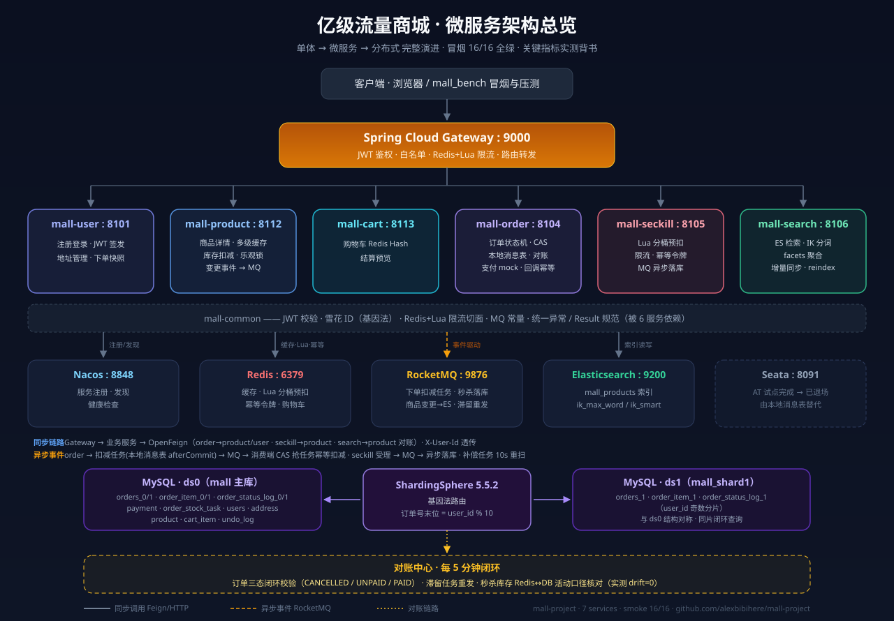

# 亿级流量商城（mall-project）

类京东/淘宝架构的**高并发商城**——从单体跑通到微服务化、分布式化完整演进，每个技术点都有真代码、压测数据与冒烟验证背书。

> 面试定位：京东亿级流量方法论的开源件实证版。同样的缓存漏斗、异步化削峰、Lua 防超卖、最终一致+对账兜底；每一环都亲手实现并量化过代价。



---

## 项目演进（10 个里程碑全部完成 ✅）

| 里程碑 | 内容 | 关键产出 |
|---|---|---|
| **M1** | 单体跑通核心交易链路 | 防超卖乐观锁、订单状态机 CAS、支付回调幂等、缓存旁路 |
| **M1.5** | 秒杀专项升级 | Redis Lua 分桶预扣、幂等令牌、一人一单、限流 |
| **M2.1** | 微服务化 | 7 服务 + Nacos + Gateway 鉴权路由 + OpenFeign 拆链 |
| **M2.2** | 分布式事务试点 + 限流 | Seata AT 全局回滚实证、Sentinel 参数级流控语义 |
| **M2.3** | ES 商品搜索全链路 | IK 分词索引、MQ 增量同步、检索聚合、reindex 对账 |
| **M2.4** | 压测对比报告 | [docs/BENCH_M2_REPORT.md](docs/BENCH_M2_REPORT.md) |
| **M3.0** | 订单状态机完善 | 集中校验 + order_status_log 流水审计 |
| **M3.1** | 去 AT 改最终一致 | 本地消息表 order_stock_task + CAS 抢任务 + 补偿重扫 |
| **M3.2** | 分库分表 | ShardingSphere 5.5.2 + 基因法路由（订单号末位嵌 user_id 基因） |
| **M3.3** | 对账中心 | 订单状态闭环对账 + 秒杀库存 Redis↔DB 对账 |

## 架构总览

```
用户 → Gateway(:9000 鉴权/限流/路由)
    ├─ mall-user      :8101  注册登录/地址(JWT + 快照)
    ├─ mall-product   :8112  商品/库存(多级缓存 Caffeine→Redis→DB, 虚拟线程)
    ├─ mall-cart      :8113  购物车(Redis)
    ├─ mall-order     :8104  订单/支付(状态机 + 本地消息表 + 分库分表 + 对账)
    ├─ mall-seckill   :8105  秒杀(分桶 Lua 预扣 + 限流 + MQ 异步落库 + 库存对账)
    └─ mall-search    :8106  搜索(ES 8.11.4 + IK, MQ 同步 + reindex)
中间件: Nacos(注册) / Redis / RocketMQ / Seata / Elasticsearch / MySQL×2
```

**下单链路（最终一致）**：校验+订单落库+任务表落库（同一本地事务）→ afterCommit 发 MQ → 消费端 CAS 抢任务幂等扣减 → 库存不足自动关单+精确回补；补偿任务每 10s 重扫滞留任务，对账任务每 5 分钟闭环校验。

## 技术栈

| 层 | 选型 |
|---|---|
| 语言/框架 | JDK 21（虚拟线程）+ Spring Boot 3.5 + Spring Cloud 2023 + Alibaba 2023 |
| 微服务 | Nacos 注册发现 · Spring Cloud Gateway · OpenFeign + LoadBalancer |
| 数据 | MySQL 8.0 × 2 库 · **ShardingSphere-JDBC 5.5.2**（编程式配置）· MyBatis-Plus |
| 缓存 | Redis 7（分桶 Lua/幂等/购物车/缓存）+ Caffeine 本地缓存 |
| 消息 | RocketMQ 5（事务消息思路/异步落库/增量同步/补偿重扫） |
| 搜索 | Elasticsearch 8.11.4 + IK（ik_max_word 索引 / ik_smart 检索） |
| 事务 | 本地消息表最终一致（主）· Seata AT 已试点并实测代价后退场 |
| 弹性 | Redis+Lua 滑动窗口限流（Sentinel ParamFlow 语义）· 幂等令牌 · CAS 状态机 |
| 部署 | Docker Compose（Nacos/Redis/RocketMQ/Seata/ES）· restart: always |

## 核心实测数据（单机同口径纵向对比）

| 指标 | M1 单体 | M3 现状 |
|---|---|---|
| 同步下单 QPS | 167.6 | 22.5（AT 时期实测；M3.1 去 AT 后回升，详见报告） |
| 缓存热读 QPS | 5224~6504 | **3036.8**（P99 47.6ms，2500 请求 0 失败） |
| 秒杀受理 TPS | — | **89.1**（P99 116.2ms） |
| 防超卖 | 0 超卖 | **0 超卖**（受理=Redis=DB 三方核对） |
| 分片路由正确率 | — | 新单 3/3 ✓（基因法同片闭环） |
| 对账 | — | drift=0（活动口径） |

> **关键架构结论**（有数据背书的面试讲点）：Seata AT 使下单吞吐 -86.6%（167.6→22.5 QPS），这正是京东骨干链路不用强一致分布式事务、而用「本地消息表+对账兜底」的量化注脚。

## 快速开始

```bash
# 0. 基础设施（Docker Compose：Nacos/Redis/RocketMQ/Seata/ES）
cd deploy && docker compose up -d && cd ..
# ES 首次需装 IK（容器内执行）
docker exec mall-es sh /install-ik.sh

# 1. 建库建表（mall + mall_shard1 + 分表，幂等）
mysql -uroot -proot < sql/schema.sql
mysql -uroot -proot mall < sql/V3_0__order_status_log.sql
mysql -uroot -proot mall < sql/V3_1__order_stock_task.sql

# 2. 编译打包（8 模块）
mvn.cmd clean package -DskipTests

# 3. 按序启动 7 服务（见架构图端口）
java -jar mall-user-service/target/mall-user-service-2.0.0.jar
java -jar mall-product-service/target/mall-product-service-2.0.0.jar
# ... cart/order/seckill/search/gateway 同理

# 4. 全链路冒烟（16 步：注册→登录→地址→加购→下单→支付幂等→秒杀限购→AT回滚语义→ES→对账）
python scripts/mall_bench.py smoke

# 5. 压测（同步下单 / 秒杀）
python scripts/mall_bench.py bench --total 300
python scripts/mall_bench.py bench --bench-mode seckill --threads 30 --total 200 --product-id 3
```

## 目录结构

```
├── mall-common/            公共：JWT/雪花ID(基因法)/MQ常量/限流切面/异常处理
├── mall-gateway/           网关：路由/JWT校验/白名单
├── mall-user-service/      用户：注册登录/地址
├── mall-product-service/   商品：详情多级缓存/库存扣减/变更事件/MQ
├── mall-cart-service/      购物车：Redis Hash
├── mall-order-service/     订单：状态机/本地消息表/分库分表/秒杀单消费/对账
├── mall-seckill-service/   秒杀：分桶Lua/限流幂等/库存对账
├── mall-search-service/    搜索：ES索引/同步/检索聚合
├── deploy/                 docker-compose.yml + ES/IK 安装脚本 + RocketMQ 配置
├── sql/                    建表脚本（schema + V3.x 增量）
├── scripts/                mall_bench.py 冒烟/压测 一体化脚本
└── docs/                   方案文档×4 + 压测报告 + 进度看板 + 功能清单(12板块60功能点)
```

## 文档索引

| 文档 | 内容 |
|---|---|
| [docs/亿级流量商城技术方案_v1.md](docs/亿级流量商城技术方案_v1.md) | 总体方案：选型/架构/八大技术专题/考点映射 |
| [docs/功能板块与功能点清单_v1.md](docs/功能板块与功能点清单_v1.md) | 12 板块 60 功能点清单与里程碑映射 |
| [docs/BENCH_M2_REPORT.md](docs/BENCH_M2_REPORT.md) | 压测对比报告（含 Seata -86.6% 归因） |
| [docs/INTERVIEW_GUIDE.md](docs/INTERVIEW_GUIDE.md) | ⭐ 面试叙事手册：架构/理念/追问弹药库 |
| [docs/TECH_INTERVIEW_QA.md](docs/TECH_INTERVIEW_QA.md) | ⭐ 技术点×面试题全景对照表（11 大类+三分钟自述模板） |
| [docs/TECH_IMPLEMENTATION.md](docs/TECH_IMPLEMENTATION.md) | ⭐ 技术实现文档：12 大核心技术+核心代码展示 |
| [docs/PENDING_TASKS.md](docs/PENDING_TASKS.md) | 未完成任务与基线数据速查 |
| [docs/PROGRESS_M2.1.md](docs/PROGRESS_M2.1.md) | 环境坑/构建铁律/端口表 |

## 环境要求

- JDK 21 · Maven 3.9+ · Docker Desktop · MySQL 8.0（root/root）· Python 3.11（冒烟/压测）
- Windows 开发注意：git-bash 下用 `mvn.cmd`；系统代理会让 localhost curl 502，用 `--noproxy '*'`
